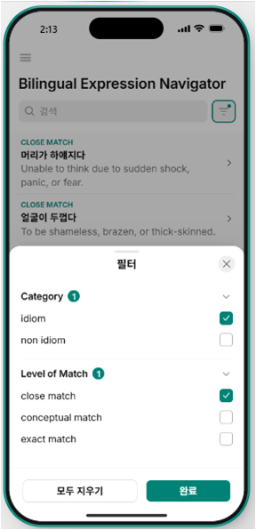
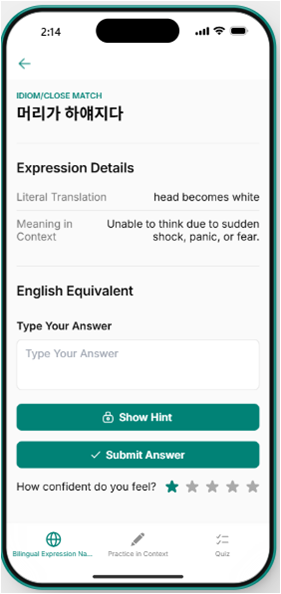

# Bilingual-Expression-Navigator
An interactive ESL learning web app that bridges Korean and English expressions by focusing on linguistic universality and match levels.

# Bilingual Expression Navigator

An interactive ESL learning web app that bridges Korean and English expressions by focusing on linguistic universality and match levels.
---

## 1. Overview
* **Project Name:** Bilingual Expression Navigator
* **Project Concept:** An educational application developed to help ESL (English as a Second Language) learners master natural English equivalents for Korean expressions by highlighting linguistic universality and matching categories.

---

## 2. Problem Statement
* **Linguistic Misconception:** ESL learners are frequently taught that Korean and English are fundamentally different and that direct translation of Korean thoughts should be avoided. This creates a psychological barrier, causing hesitation and a lack of confidence when learners try to express themselves.
* **Limitations of Rote Memorization:** Many learners rely on mechanically memorizing English equivalents without understanding the shared conceptual ground. This limits their ability to use idiomatic expressions naturally, restricting diverse and nuanced communication.

---

## 3. Solution
* **Linguistic Universality:** Shifting the focus to common ground between the two languages, English and Korean expressions actually share a surprising amount of conceptual and lexical similarity—particularly in idioms involving the body, movement, animals, colors, and proverbs.
* **The App:** An interactive application that enables learners to leverage their natural Korean phrasing first. By validating these expressions against native English equivalents, the app reinforces usage, builds speaking confidence, and accelerates language proficiency.

---

## 4. Tools Used
* **Glide:** Used to build and deploy the app user interface, managing navigation tabs, list filtering, and interactive popup sheets.
* **Google Sheets:** Utilized to structure and manage the dynamic linguistic dataset (including matching levels, literal translations, and contextual examples).

---

## 5. Key Features

* **Categorized Dataset:** Every entry includes Category (Idiom/Non-idiom), Meaning in Context, Literal English Translation, English Equivalent, Level of Match, Contextual Sentences, and Hints.
* **Core Learning Flow:** A master-detail interface featuring searchable, filterable expressions categorized by match levels, complete with self-prediction fields, hint triggers, and confidence self-evaluations.

* **"Practice in Context" Mode:** A dedicated menu where learners review expressions within an interactive, fill-in-the-blank sentence framework to master practical application.
* **"Quiz" Mode:** A dynamic multiple-choice testing feature allowing learners to quiz themselves on Korean-English expression pairs and instantly validate their answers.

---

## 6. Design Rationale
* **Match Level Tri-Categorization:** Data is classified into:
  * *Exact Match:* Identical phrasing when expressing the same concept.
  * *Close Match:* Same concept expressed with minor differences in lexical choices.
  * *Conceptual Match:* Culturally distinct imagery but sharing the identical underlying theme.
* **Active Recall Over Passive Review:** The user flow mandates a "Self-Prediction" or typing phase prior to answer exposure, prompting learners to engage in critical thinking before clicking `[Reveal Answer]` or `[Answer]`.
* **Contextual Validation:** Answers are presented in an exact "Use in Context" format so learners grasp the correct situational syntax and nuances.

---

## 7. Limitations
* **Fixed Multiple-Choice Variation:** The Quiz feature relies on a predetermined structure, which may limit the variations of distractor choices presented to users.
* **Manual Answer Validation for Typing:** In the "Practice in Context" flow, answer validation is reliant on a static popup confirmation sheet rather than an automated, real-time natural language processing.

---

## 8. Future Improvements
* Implement use progress tracking
* Expand expression dataset
* Add audio pronunciation feature
  
